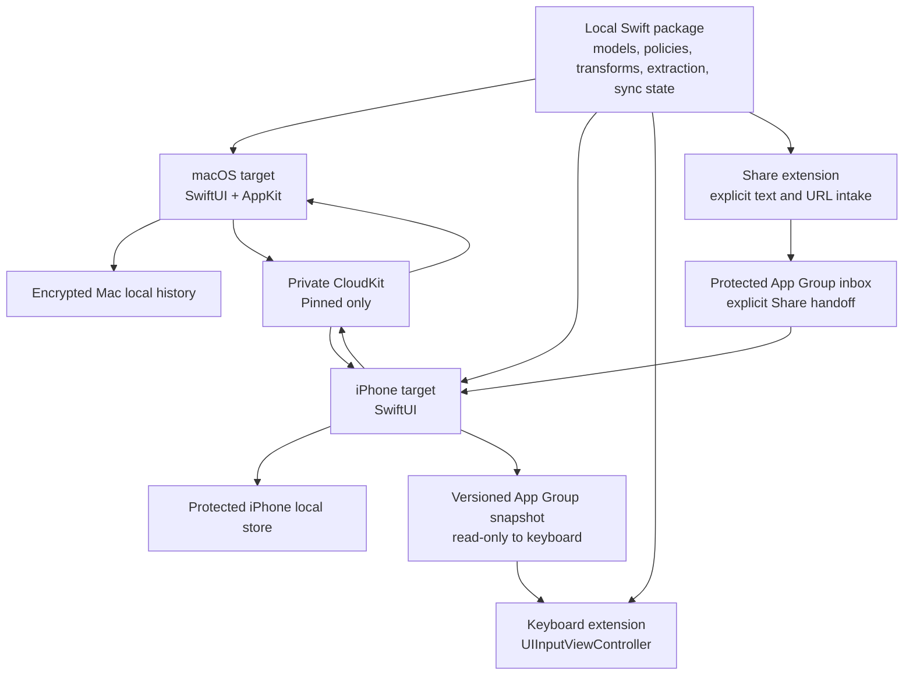
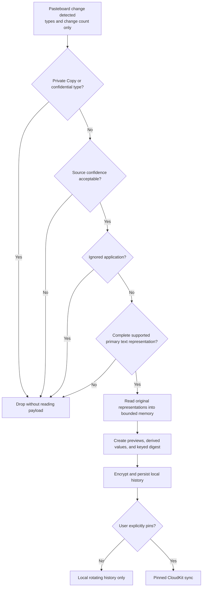

# Clipboard Keyboard Apple MVP Design

## Status

- Approved design: 2026-08-13
- Repository: `clipboard-keyboard`
- Platforms: macOS and iPhone, including an iOS custom keyboard extension
- Implementation state: implemented and merged on 2026-08-15; signed and manual release gates are tracked in `docs/notes/apple-mvp-release-evidence.md`

## Product statement

Clipboard Keyboard is not a clipboard that remembers everything.
It is a privacy-first keyboard and library for prompts, code, and everyday information in which the user controls what becomes durable.

The macOS app keeps a short, local, rotating history for retrieval.
Only content the user explicitly pins is eligible for cross-device synchronization.
The iPhone app manages pinned content and extracts useful values from larger messages.
The keyboard extension inserts the resulting text without requiring Full Access.

## Problem

The product serves two primary workflows.

1. A user who copies prompts and code on a Mac needs a lightweight menu bar search surface that preserves whitespace and source formatting.
2. A user who receives a message containing an account number, phone number, email address, URL, or one-time code needs to extract and reuse only that value without manually pasting the entire message into an editor and selecting a substring.

Conventional always-on clipboard history creates an unacceptable security boundary because copied credentials, private messages, and tokens can enter durable storage without a deliberate decision.
This design therefore separates transient system copying, local rotating history, and explicitly pinned data.

## Goals

- Provide a lightweight, keyboard-first macOS menu bar history with search.
- Preserve original text representations, including plain text, RTF, HTML, and explicitly identified Markdown.
- Keep unpinned Mac history on the Mac and remove it according to a short retention policy.
- Synchronize only explicitly pinned content through the user's private CloudKit database.
- Let the iPhone app extract useful values on-device and pin only the selected value.
- Let the iOS keyboard search and insert pinned text with Full Access disabled.
- Let users bypass all application storage for one copy with `Shift-Command-C` where macOS Services are supported.
- Hard-ignore confidential pasteboard types used by password managers, including the recognized 1Password marker, and apply user-selected application filters as a best-effort defense in depth.
- Avoid an application-level character-count limit and never silently truncate content.
- Provide explicit text import, export, sharing, and Shortcuts actions.

## Non-goals for the Apple MVP

- Automatic paste into the previously active Mac application.
- A custom cross-device relay for unpinned clipboard items.
- Continuous iPhone clipboard monitoring.
- Image, RTFD, arbitrary file, or OCR history.
- AI classification or semantic search.
- User-authored transformation scripts.
- A complete library backup archive.
- Android support.
- Team libraries or shared CloudKit databases.
- A claim that all synchronized data is unconditionally end-to-end encrypted.

## Product boundaries

### Retention classes

| Class            | Trigger                                                                                                                              | Persistence                                                                                       | Cross-device behavior                                                       |
| ---------------- | ------------------------------------------------------------------------------------------------------------------------------------ | ------------------------------------------------------------------------------------------------- | --------------------------------------------------------------------------- |
| Ignored          | Private Copy marker, confidential type, active capture pause, detected ignored application, ambiguous source, or unsupported payload | None                                                                                              | None                                                                        |
| System ephemeral | Ordinary system copy that the application does not accept                                                                            | None in this product                                                                              | macOS Universal Clipboard may transfer it under Apple's own behavior        |
| Local history    | Accepted Mac copy                                                                                                                    | Encrypted local storage, default 24 hours or 200 unpinned items, whichever limit is reached first | Never written to CloudKit                                                   |
| Pinned           | Explicit Pin or explicit Shortcuts/Share action                                                                                      | Local durable storage until deletion                                                              | Written to the user's private CloudKit database when iCloud sync is enabled |

Universal Clipboard participates automatically through the general pasteboard, and Apple does not expose a macOS API for controlling that feature.
The application therefore promises only that ignored and system-ephemeral content is absent from its database, search index, App Group cache, logs, and CloudKit writes; it does not promise an exact Universal Clipboard expiration time.
[Apple documents the general pasteboard and Universal Clipboard boundary](https://developer.apple.com/documentation/appkit/nspasteboard).

### Default local retention

Unpinned Mac history defaults to 24 hours or 200 items, whichever limit is reached first.
The user can shorten or disable local history.
Pinned items are not counted against the unpinned item limit and remain until explicit deletion.
Before the first automatic capture, onboarding requires explicit consent and shows the active retention limits; capture remains paused until consent.

## Architecture

Mac and iPhone both send and receive pinned revisions, conflicts, reset generations, and deletion tombstones through CloudKit.

The Apple MVP is native rather than Flutter-based because its primary responsibilities are AppKit pasteboard monitoring, a macOS Service, CloudKit, App Groups, App Intents, a Share extension, and a UIKit keyboard extension.
The local Swift package contains only platform-independent domain logic and test doubles.
AppKit, UIKit, SwiftUI, CloudKit, Keychain, and App Group adapters remain in their owning targets.

The baseline deployment targets are iOS 17 and macOS 14.
The implementation plan must confirm the installed Xcode toolchain before project generation, but it must not raise these minimum versions without a product requirement.

### Shared domain package

The package owns:

- Immutable clip and representation models.
- Retention classification and privacy-decision types.
- Deterministic transformations and value-candidate extraction.
- Search normalization and ranking contracts.
- Pinned revision, conflict, and tombstone state machines.
- Versioned keyboard snapshot schemas and integrity validation.

The package does not own platform pasteboards, database implementations, network calls, or views.
This boundary keeps the package small enough to test without launching an app or extension.

### macOS target

The macOS application uses an `NSStatusItem` and a focused `NSPanel` hosting SwiftUI content for its menu bar search palette.
It uses AppKit's general pasteboard and compares `changeCount` on a default 500 millisecond timer because `changeCount` is the documented ownership-change signal.
[Apple documents `NSPasteboard.changeCount`](https://developer.apple.com/documentation/appkit/nspasteboard/changecount).

The target owns:

- Pasteboard metadata polling and representation reads.
- Active-application observations used only as a confidence signal.
- The pre-read Privacy Gate.
- Encrypted local history and in-memory search index.
- Global palette shortcut and Private Copy Service.
- Settings, pause state, login-item opt-in, and local deletion.
- CloudKit synchronization of pinned records only.

The app is an agent-style background application with a settings window.
Login launch is opt-in and uses `SMAppService.mainApp` rather than a separate helper.

### iPhone target

The iPhone application owns:

- Pinned library browsing, searching, editing, and deletion.
- Explicit clipboard intake through a system paste control.
- On-device value-candidate extraction and confirmation.
- Text file import and item-level export/share.
- CloudKit synchronization and offline state presentation.
- Atomic publication of a minimal keyboard snapshot to the App Group container.
- App Intents and App Shortcuts.

The application never polls the iPhone pasteboard in the background.

### Keyboard extension

The keyboard extension is a text insertion surface, not a clipboard monitor or cloud client.
It reads a minimal, versioned App Group snapshot, searches locally, and inserts the selected string through `UITextDocumentProxy`.
[Apple documents direct custom-keyboard text insertion](https://developer.apple.com/documentation/uikit/handling-text-interactions-in-custom-keyboards).

The keyboard ships with `RequestsOpenAccess` disabled.
Apple documents that a keyboard without open access has no network access or shared-container write access, while read-only access to the containing app's shared containers is permitted.
[Apple documents custom-keyboard open access](https://developer.apple.com/documentation/uikit/configuring-open-access-for-a-custom-keyboard).

The extension does not read the general pasteboard, write usage history, update pinned items, or invoke CloudKit.
Secure fields, phone-pad fields, and host applications that reject third-party keyboards may cause iOS to substitute the system keyboard, so the product does not promise availability in every field.
[Apple documents custom-keyboard interface restrictions](https://developer.apple.com/documentation/uikit/configuring-a-custom-keyboard-interface).

### Share extension and Shortcuts

The Share extension accepts one text or URL item at a time.
It shows a preview and requires an explicit Pin decision before durable storage.
It hands the validated item to the containing app through a versioned App Group inbox and never writes CloudKit directly.
An inbox handoff is not a successful Pin until the containing app validates and commits it; terminal rejection or successful consumption deletes the inbox item.

The Apple MVP exposes three actions:

- Pin Text: accept explicit text input and create a pinned item.
- Extract Values: accept explicit text input and present deterministic candidates.
- Find Pinned: search the local pinned library and return or copy a selected text value.

All three intents use `requiresLocalDeviceAuthentication` because App Intents otherwise default to allowing execution while the device is locked.
They return only a content-free locked error when authentication is unavailable.
[Apple documents App Intent authentication policies](https://developer.apple.com/documentation/appintents/appintent/authenticationpolicy).

## Pre-storage Privacy Gate

Privacy decisions occur before payload reading, preview generation, search normalization, extraction, logging, deduplication, persistence, or synchronization.

### Decision order

1. Compare pasteboard change count without reading representation bytes.
2. Inspect type identifiers for the application Private Copy marker and recognized concealed, transient, or autogenerated markers.
3. Evaluate source confidence.
4. Apply the best-effort ignored-application rule when an ignored application is the stable foreground application.
5. Verify that at least one supported primary text representation is declared and can be read completely within current resource availability.
6. Read bytes into memory, then derive previews, transformations, candidates, and a keyed digest.
7. Encrypt and persist the accepted local record.
8. Write to CloudKit only after an explicit Pin transition.

`NSPasteboard` does not provide a reliable source-application identity.
The watcher therefore labels a source as `inferredStableForeground` only when the active application remains stable across the observation interval and no activation event races the pasteboard change.
An app activation during the same interval, an unidentifiable foreground process, or another ambiguity produces `unknown`, which is dropped by default.
The user can choose `Save Current Clipboard` to authorize a one-time read of an otherwise unknown item through the explicit flow below.

Ignored applications are selected through an application picker, which records the installed application's bundle identifier and code-signing identity rather than its display name.
The app offers resolved, installed password managers such as 1Password as recommended filters; it does not create a trusted filter from an unverified guessed identifier.
The baseline confidential-type list includes `com.agilebits.onepassword`, which Maccy treats as a 1Password marker, in addition to concealed, transient, and autogenerated pasteboard markers.
[Maccy's official documentation lists its default confidential pasteboard types](https://github.com/p0deje/Maccy#ignore-custom-copy-types).
Release validation must inspect the current installed password-manager behavior rather than assume that this historical type covers every version or copy path.
Confidential pasteboard markers still take precedence over application rules.

Application filtering is defense in depth, not proof of the pasteboard writer.
`NSPasteboard` does not expose a reliable writer identity, and a background helper or quick-access window can write while a different application appears foreground.
The UI and privacy documentation therefore reserve hard exclusion guarantees for recognized confidential markers, a successful Private Copy marker, and an explicitly active capture pause.

### Explicit Save Current Clipboard

Invoking `Save Current Clipboard` is the pre-read authorization for exactly one current change count.
The app first evaluates Private Copy and confidential type markers; those remain non-overridable and are dropped without reading payload bytes.
For an eligible item, it reads complete supported text representations into volatile memory, displays a redacted preview, and persists only after a second explicit Save confirmation.
Cancel, timeout, representation failure, or a changed pasteboard purges the volatile data without producing a record or content log.

For a mixed pasteboard item, plain text is the preferred canonical insertion representation, followed by lossless text derived from RTF and then HTML.
The app preserves every fully readable supported text representation, ignores unrelated nonconfidential auxiliary types, and rejects the entire item if a declared supported representation cannot be read completely.
A confidential marker rejects the entire item regardless of other types.

### Private Copy

The macOS Service uses `Shift-Command-C` when the foreground application exposes selected content to Services.
It writes the selected content back to the general pasteboard together with an application-specific Private Copy type marker.
The watcher recognizes the marker before reading content and excludes the copy from capture, preview, indexing, extraction, logging, and persistence.
The Service keeps selected bytes only for the in-memory pass-through transaction and does not create a preview or content log.

A visible shield confirmation is the only success indication.
If another application consumes the shortcut or does not support Services, the app does not claim success.
The secure menu bar fallback is `Pause Capture for 60 Seconds`.
It shows a visible countdown, drops every pasteboard change during the interval, allows early manual resume, and never treats an uncorrelated ownership change as the intended private copy.

A one-shot control that skips only the next pasteboard change was considered and rejected as unreliable.
Such a control has to identify one specific future change as the intended one, and this design already establishes that the watcher cannot make that identification: an activation event can race the pasteboard change, and a background helper can write while a different application appears foreground.
The next change is therefore not reliably the change the user meant to shield, so the fixed interval is used instead because discarding every change it covers requires no identification at all.

Private Copy does not disable Apple's Universal Clipboard and does not erase the system pasteboard.

## Content model

An accepted item becomes an immutable `ClipEnvelope` with:

- Stable identifier and capture timestamp.
- Retention class and source-confidence value.
- One or more immutable original representations.
- Each representation's uniform type identifier, complete bytes, byte size, and keyed digest.
- Encrypted title, inferred content kind, and optional user category.
- Derived preview and detected-value candidates.
- Pinned revision and synchronization state when applicable.

Every accepted text item also has one canonical insertion string.
It is the exact plain-text representation when present, otherwise a deterministic lossless text projection from RTF or HTML.
The keyboard snapshot contains this insertion string only; it never contains RTF or HTML bytes.

Ignored and system-ephemeral events never become `ClipEnvelope` records.

Original representations are immutable.
Editing a pinned item or applying a transformation creates a new representation or pinned revision rather than overwriting source bytes.
Derived previews, search terms, and extraction candidates can be discarded and recomputed.

### Supported Apple MVP representations

- Plain text.
- RTF.
- HTML.
- Markdown when the user declares it, imports a `.md` file, or explicitly saves a Markdown variant.

The app may suggest that plain text resembles Markdown or source code, but it does not silently change the primary type or invent a file extension.
Code preserves whitespace and line endings exactly.

When an item is copied from Mac history, the app restores every compatible original representation to the general pasteboard so the destination application can choose its preferred form.
Explicit Copy As actions can instead publish plain text, Markdown source, HTML, RTF, digits only, or whitespace-normalized text.

Default individual export formats are `.txt` for plain text, `.md` for declared Markdown, `.rtf` for RTF, and `.html` for HTML.
The complete multi-item JSON backup format is deferred to the Media update.

The application imposes no character-count limit.
It attempts to preserve the full representation and never stores a prefix as if it were complete.
If full capture, encryption, or persistence fails because of platform or resource limits, it drops the application record, leaves the system clipboard unchanged, and surfaces the reason without content.

## Transformations and value extraction

Transformations are deterministic, on-device, and derived from immutable source content.
The MVP includes:

- Plain text conversion.
- Markdown source.
- HTML and RTF variants where a lossless source representation exists.
- Digits only.
- Trim surrounding whitespace.
- Normalize internal whitespace as an explicit action.

Value extraction produces candidates rather than silently replacing the source.
Candidate kinds are:

- Phone number.
- Email address.
- URL.
- One-time code.
- Account-number candidate.

Account-number extraction is deliberately conservative.
A numeric sequence becomes an account-number candidate only when its length and separators are plausible and nearby Korean context contains an account or transfer cue such as a bank name, `계좌`, or `입금`.
The app does not infer a bank from digits alone.
Each candidate shows its source context and supports original, digits-only, and normalized variants where applicable.

The user can copy a candidate without saving it or pin only that candidate.
Pinning a candidate does not pin the full source message.
Candidate results are not synchronized unless the user pins the result.

## Storage and synchronization

### Mac local history

Local payloads, titles, previews, source hints, and derived values are encrypted per record with CryptoKit authenticated encryption.
A randomly generated master key is stored in the user's Keychain.
The persistent metadata required for retention contains only opaque identifiers, timestamps, sizes, representation types, and keyed digests.
Searchable plaintext exists only in bounded process memory while the application is unlocked and running.

If the Keychain key is unavailable, the application does not create a plaintext fallback database and skips capture until protected storage is available.

### Pinned CloudKit data

Pinned records use the user's private CloudKit database.
The canonical insertion string and every supported original text representation in the set Plain Text, Markdown, RTF, and HTML synchronize together.
Content, title, category, and other user-authored inline fields use `CKRecord.encryptedValues`.
Serialized pinned payloads up to a conservative product threshold of 512 KiB use encrypted fields; larger text payloads use a `CKAsset` in the Apple MVP because non-asset record data is limited.
The asset contains CryptoKit-authenticated ciphertext, and its per-item content key is stored through `encryptedValues`.
CloudKit also encrypts `CKAsset` by default in a private database.
Encrypted fields cannot be server-indexed, so pinned search is local.
[Apple documents encrypted CloudKit fields and assets](https://developer.apple.com/documentation/cloudkit/encrypting-user-data).
[Apple documents that large binary data belongs in `CKAsset`](https://developer.apple.com/documentation/cloudkit/ckrecord).

The product describes this as private iCloud synchronization with encrypted fields.
It does not market unconditional end-to-end encryption because the precise protection depends on the user's iCloud security configuration.

No custom application server participates in the Apple MVP.
CloudKit synchronization is off until the user explicitly enables it during onboarding or Settings.
Disabling synchronization stops future CloudKit reads and writes but does not delete records already uploaded.
An authenticated `Delete Cloud Data` action advances a content-free library reset generation, removes keyboard content immediately, requests deletion of all content records in the private database, and remains visibly pending until CloudKit confirms completion.
The reset-generation record remains so an offline stale device cannot republish content from an older generation when it reconnects.
The action requires device-owner authentication and a destructive confirmation.

### Revisions, conflicts, and deletion

Pinned content edits create immutable revisions.
Concurrent edits preserve the server-selected record and create a clearly labeled conflict copy for the losing content instead of silently discarding it.

Deletion immediately removes content from the local library and keyboard snapshot.
The CloudKit record becomes a content-free tombstone with a higher generation, and tombstones remain so a stale device cannot recreate deleted content.
A delete-versus-edit conflict resolves to deletion.
Deletion purges all content-bearing local revisions, unsynchronized edits, decoded caches, and recovery data; deleted content is not recoverable through the app.

Offline saves and deletes show `Sync Pending` or `Deletion Pending` until CloudKit confirms them.
The UI never reports remote success before confirmation.

### iPhone store and keyboard snapshot

The iPhone app keeps its pinned working set under `NSFileProtectionComplete`.
It publishes only identifiers, titles, categories, and insertion strings needed by the keyboard.
The snapshot includes a schema version, generation, creation time, last successful CloudKit refresh time, content digest, and item count.

The App Group inbox, temporary snapshot, and final snapshot all use `NSFileProtectionComplete`.
Publication writes and validates a complete temporary snapshot, atomically replaces the prior file, and verifies that the final file retained the required protection class.
The keyboard treats an unknown schema, digest mismatch, partial read, or locked container as empty and displays `Open the app to sync` without attempting partial recovery.
When protected data becomes unavailable, the app and extension purge decoded snapshot and inbox values from memory and close cached file handles.
Processed or terminally rejected inbox files are deleted; a handoff write failure leaves no pinned record and removes its temporary file.
The keyboard never writes to the snapshot.

A valid snapshot remains usable offline regardless of age.
If its last successful CloudKit refresh is more than 24 hours old, the keyboard shows `Refresh recommended` without hiding valid items.

## User experience

### macOS menu bar palette

The palette opens from the menu bar or a configurable global shortcut.
It contains one search field and two scopes, Recent and Pinned.
Rows show a bounded single-line preview, type, relative capture time, and source-confidence status where useful.

Keyboard behavior is:

- Arrow keys move selection.
- Return copies all original compatible representations and closes the palette.
- A secondary action copies as a chosen format.
- Pin, Export, and Delete are explicit row actions.

The palette exposes visible Paused, Capture Pause Countdown, Protected Storage Locked, Sync Pending, and Deletion Pending states.
Automatic paste is excluded from the MVP because it would add Accessibility permission to the initial trust boundary.

### iPhone application

The application has three primary areas:

- Library: search pinned items and filter by Prompts, Code, Everyday, or Uncategorized.
- Extract: invoke a system paste control, preview the provided text, inspect candidates, and copy or pin one selected value.
- Settings: inspect synchronization and cache status, review privacy behavior, delete cloud data, and access import/export help.

The built-in categories are organizational labels, not automatic retention rules.
Automatic type suggestions never cause a Pin.

### iOS keyboard

The keyboard opens to pinned search with category filters for Prompts, Code, and Everyday.
Tapping an item inserts its text at the cursor.
Rich text, images, and files are handled by the containing app rather than the keyboard.

The keyboard shows snapshot freshness and noninteractive instructions to switch to the containing app when the cache is unavailable.
Custom keyboards have no documented API that reliably opens their containing application, so the MVP does not use unsupported responder-chain workarounds.
It does not ask for Full Access.

## Failure handling

| Failure                                                           | Required behavior                                                                                                                                       |
| ----------------------------------------------------------------- | ------------------------------------------------------------------------------------------------------------------------------------------------------- |
| Private Copy shortcut was not handled                             | No success shield; offer the visible 60-second capture pause                                                                                            |
| Source is unknown or raced an app activation                      | Drop automatically; allow explicit Save Current Clipboard                                                                                               |
| Ignored app was not reliably identified as foreground             | Do not promise exclusion; confidential markers and explicit pause remain the hard controls                                                              |
| Keychain or encrypted store unavailable                           | Skip capture; never persist plaintext                                                                                                                   |
| Local database write fails                                        | Keep system clipboard intact and show a content-free failure state                                                                                      |
| Unsupported representation                                        | Leave no metadata-only history row                                                                                                                      |
| Full payload cannot be preserved                                  | Skip the item; never truncate silently                                                                                                                  |
| CloudKit is offline                                               | Keep local pinned item usable and show pending state                                                                                                    |
| A pinned payload exceeds the inline CloudKit threshold            | Encrypt the complete payload into a text `CKAsset`; on terminal asset failure keep it local and show `Unable to Sync Full Item`, not indefinite pending |
| Remote delete is pending                                          | Remove local and keyboard content immediately; retain pending tombstone                                                                                 |
| CloudKit encrypted key was reset                                  | Treat remote encrypted data as unavailable, explain recovery, and require explicit user choice before re-uploading local data                           |
| Keyboard snapshot is locked, corrupt, or newer than the extension | Fail closed to an empty library and direct the user to the app                                                                                          |

Logs and crash diagnostics never contain clipboard bytes, previews, titles, search queries, extracted values, or imported filenames.
The MVP includes no third-party analytics SDK.
Operational logs use fixed event identifiers, opaque record IDs, error categories, byte counts, and timings only.

## Release sequence

### Apple MVP

- Native macOS menu bar app with local Text, RTF, HTML, and Markdown history.
- Search, pinned categories, encrypted local retention, pause, best-effort app filters, confidential-type rules, and the Private Copy Service.
- Private CloudKit synchronization of pinned Plain Text, Markdown, RTF, and HTML, using an encrypted text asset when the complete payload exceeds the inline threshold.
- Native iPhone pinned library and deterministic value extraction.
- Full-Access-free iOS keyboard reading a protected App Group snapshot.
- Explicit text and URL Share extension intake.
- Pin Text, Extract Values, and Find Pinned Shortcuts actions.
- Item-level TXT, MD, RTF, and HTML import/export/share.

### Media update

- Image, RTFD, and sandbox-safe file representations.
- Media previews, media-specific CloudKit assets, large-payload export, and optional on-device OCR.
- Complete versioned library backup and restore.

### Android expansion

- A separate Android application and keyboard client.
- Reuse of the pinned data and transformation contract, not Apple implementation details.
- A separate design and implementation plan after Apple behavior is validated.

## Verification strategy

### Unit tests

- Privacy Gate precedence for Private Copy, confidential types, source confidence, ignored applications, unsupported data, and accepted content.
- Explicit Save Current Clipboard authorization, second confirmation, cancellation, timeout, and pasteboard-change invalidation.
- Retention boundaries for age, count, pin exemption, and disabled history.
- Immutable representation selection and every Copy As transformation.
- Mixed pasteboard items containing supported text, unreadable supported text, unrelated auxiliary types, and confidential markers.
- Korean candidate extraction with positive and negative account-number fixtures.
- Search normalization, ranking, and whitespace preservation for prompts and code.
- Pinned conflict, deletion-wins, tombstone, retry, and recovery state machines.
- Keyboard snapshot encoding, digest validation, schema mismatch, partial files, and atomic replacement.

### macOS integration tests

- Pasteboard fixtures carrying multiple representations.
- Private marker evaluation before any payload read spy is invoked.
- Ignored application and concealed/transient marker handling.
- Copy followed by immediate application switching, repeated across polling boundaries.
- Keychain denial, corrupt encrypted records, disk-full simulation, and full-payload failure.
- Verification that unpinned operations produce zero CloudKit adapter writes.

### iPhone and extension integration tests

- App Group snapshot publication and read-only extension behavior.
- Full Access disabled, network unavailable, device lock/unlock, corrupt cache, and stale cache.
- `UITextDocumentProxy` insertion for multiline prompts, Unicode, emoji, and code indentation.
- `NSFileProtectionComplete` retention across App Group temporary-file replacement, inbox cleanup, and memory purge when protected data becomes unavailable.
- Share intake for text and URL success, cancellation, unsupported input, partial write, and terminal rejection.
- Pin Text, Extract Values, and Find Pinned success, cancellation, and failure with Siri and automations while the local device is locked and unlocked.
- TXT, MD, RTF, and HTML import/export round trips, including malformed input and cancelled export.

### Manual release gates

- Feed the recognized 1Password confidential pasteboard marker with every supported text representation and confirm that content, preview, search text, extracted values, and logs are absent regardless of the foreground app.
- Select an installed password manager through the application picker and verify that foreground copies are dropped, then exercise its background or quick-access copy path to confirm the UI does not represent the best-effort app filter as a hard guarantee.
- Exercise Private Copy in a Services-compatible editor and confirm the shield, system paste result, and absence from every application store.
- Exercise the shortcut-conflict and unsupported-Service fallbacks and confirm that no false success appears.
- Copy, immediately switch applications, and confirm that ambiguous source attribution is dropped.
- Round-trip plain text, RTF, and HTML through representative destination apps without changing original bytes or whitespace.
- Pin Plain Text, Markdown, RTF, and HTML on each device, synchronize bidirectionally, insert the canonical string through the keyboard with Full Access disabled, then delete offline and confirm the item does not return after reconnection.
- Pin text payloads on both sides of the 512 KiB inline threshold and confirm complete round-trip synchronization or the explicit terminal local-only state.
- Disable synchronization and confirm existing remote records remain, then run authenticated Delete Cloud Data with an offline stale device and confirm the reset generation prevents republishing after reconnection.
- Extract values from Korean message fixtures and confirm that order numbers without account context are not labeled as account numbers.
- Test progressively large text inputs and confirm either complete round-trip preservation or an explicit whole-item rejection, never truncation.

### Performance gates

- For each release candidate, record the development Mac hardware model, memory, macOS build, application commit, and Release configuration used for performance evidence.
- After a 60-second warm-up, median CPU usage during five idle minutes is below 1 percent and resident memory grows by no more than 10 MiB between the start and end samples.
- With the repository's versioned 5,000-record and query fixtures loaded, the 95th-percentile time from query change to first visible result is at most 150 milliseconds.
- Record keyboard time to first interactive content and peak resident memory on at least one supported physical iPhone; these are release observations rather than universal pass/fail gates because Apple publishes no single fixed memory limit for all keyboard extensions.

## Security and product claims

The product may claim:

- Unpinned Mac history stays on that Mac.
- Only explicit Pinned content is eligible for iCloud synchronization.
- The keyboard works without Full Access and does not access the network.
- A successful Private Copy marker, a recognized confidential marker, and a visibly active capture pause are excluded from application persistence, indexing, extraction, cache publication, synchronization, and content logging.
- CloudKit uses the user's private database and encrypted fields for pinned content.

The product must not claim:

- Exact knowledge of the application that produced every pasteboard change.
- Guaranteed exclusion based only on the foreground application's identity.
- Control over Universal Clipboard delivery or expiration.
- Availability of the custom keyboard in every text field or host application.
- Unlimited payload size.
- Unconditional end-to-end encryption.
- That every plausible number can be identified reliably as a bank account number.

## Completion criteria for this design

The Apple MVP is ready for an implementation plan when this document is reviewed and approved, repository bootstrap is scoped as the first implementation task, and every MVP requirement maps to an automated or manual verification item above.
